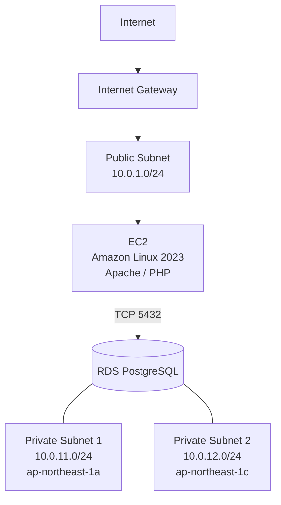
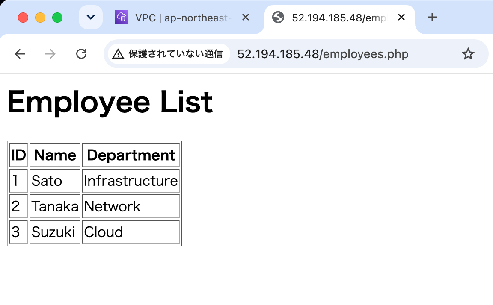
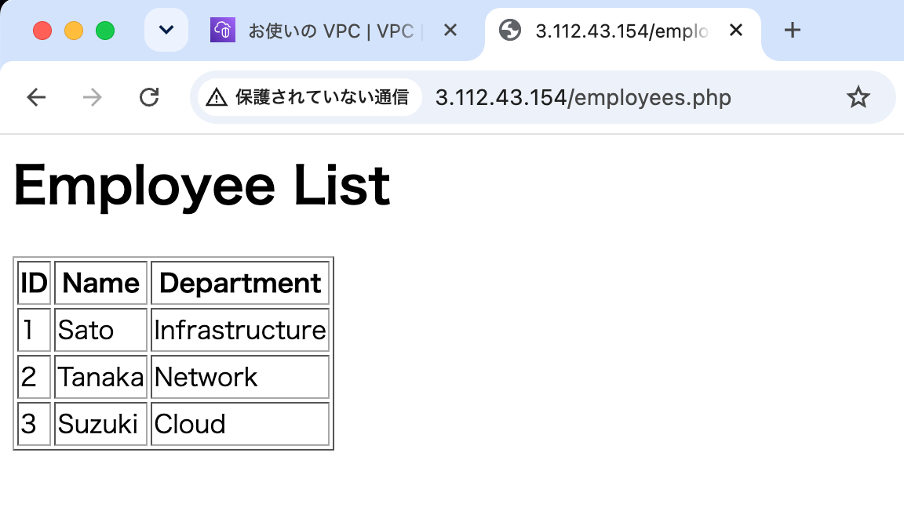

# AWS Terraform Infrastructure Hands-on

AWS上にWeb/DB構成を手動で構築し、動作確認後にTerraformでIaC化したハンズオンです。

手動構築した環境を一度削除した後、Terraformから同等のインフラを再構築し、Webアクセス、SSH接続、EC2からRDSへの通信、PostgreSQLへのTLS接続を確認しました。

## 構成



## 使用技術

- AWS
  - VPC
  - Subnet
  - Internet Gateway
  - Route Table
  - Security Group
  - EC2
  - RDS for PostgreSQL
- Terraform
- Amazon Linux 2023
- Apache HTTP Server
- PHP
- PostgreSQL

## ネットワーク

| 用途 | CIDR | AZ |
|---|---|---|
| VPC | `10.0.0.0/16` | - |
| Public Subnet | `10.0.1.0/24` | ap-northeast-1a |
| Private Subnet 1 | `10.0.11.0/24` | ap-northeast-1a |
| Private Subnet 2 | `10.0.12.0/24` | ap-northeast-1c |

## Security Group

### EC2

- HTTP TCP/80: Internetから許可
- SSH TCP/22: 指定したPublic IPのみ許可

### RDS

- PostgreSQL TCP/5432: EC2のSecurity Groupからのみ許可
- Public Access: 無効

## Terraformで構築するリソース

Terraformで以下の12リソースを構築します。

- VPC × 1
- Subnet × 3
- Internet Gateway × 1
- Route Table × 1
- Route Table Association × 1
- Security Group × 2
- DB Subnet Group × 1
- EC2 × 1
- RDS PostgreSQL × 1

EC2起動時のUser Dataにより、ApacheとPHPを自動インストールします。

## 構築・検証の流れ

1. AWS Management Consoleから手動構築
2. EC2上にApache/PHPを構築
3. EC2からRDS PostgreSQLへ接続
4. WebページからRDSのデータを表示
5. 手動構築したAWSリソースを削除
6. Terraformで同等のインフラを再構築
7. Webアクセス・SSH接続を確認
8. EC2からRDSのTCP/5432疎通を確認
9. PostgreSQLへTLS接続
10. WebからRDSデータを再度表示
11. `terraform destroy` で全リソース削除
12. `terraform plan` で再構築可能であることを確認

## Terraform実行方法

```bash
cp terraform.tfvars.example terraform.tfvars
```

`terraform.tfvars` に環境固有の値を設定します。

```hcl
ssh_allowed_cidr = "YOUR_PUBLIC_IP/32"
ec2_key_name      = "YOUR_KEYPAIR_NAME"
db_password       = "YOUR_DB_PASSWORD"
```

Terraformを実行します。

```bash
terraform init
terraform fmt
terraform validate
terraform plan
terraform apply
```

検証終了後はリソースを削除します。

```bash
terraform destroy
```

## ディレクトリ構成

```text
.
├── README.md
├── main.tf
├── outputs.tf
├── providers.tf
├── variables.tf
├── terraform.tfvars.example
├── scripts/
│   └── user_data.sh
├── docs/
│   ├── network-design.md
│   ├── build-procedure.md
│   └── test-results.md
└── evidence/
    ├── terraform-output.txt
    └── terraform-state-list.txt
```

## ドキュメント

- [ネットワーク設計](docs/network-design.md)
- [構築手順](docs/build-procedure.md)
- [試験結果](docs/test-results.md)

## 補足

- `terraform.tfvars` とTerraform StateはGit管理対象外です。
- RDSはPrivate Subnetに配置し、Public Accessを無効化しています。
- DBテーブル作成、テストデータ投入、PHPからのDB参照確認はインフラ構築後の動作確認として手動実施しています。

## 動作確認

### 手動構築環境

AWS Management Consoleから構築した環境で、EC2上のPHPからRDS PostgreSQLのデータを取得し、ブラウザ表示できることを確認しました。



### Terraform再構築環境

手動構築した環境を削除後、Terraformから同等のインフラを再構築し、同じWeb/DB連携が動作することを確認しました。


