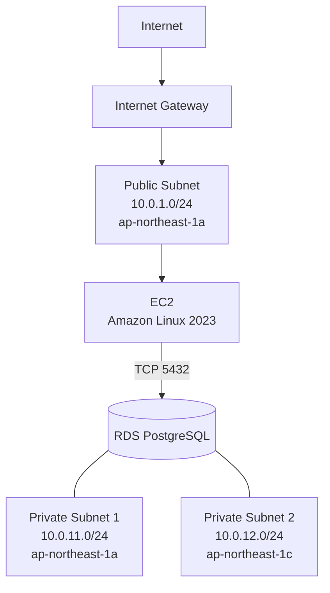

# ネットワーク設計

## 1. 構成概要

AWS上にVPCを作成し、Public SubnetにEC2、Private SubnetをRDS用として構成する。



## 2. VPC

| 項目 | 設定値 |
|---|---|
| Name | aws-terraform-vpc |
| CIDR | 10.0.0.0/16 |
| DNS Support | 有効 |
| DNS Hostnames | 有効 |

## 3. Subnet

| Name | CIDR | AZ | 用途 |
|---|---|---|---|
| public-subnet-1 | 10.0.1.0/24 | ap-northeast-1a | EC2 |
| private-subnet-1 | 10.0.11.0/24 | ap-northeast-1a | RDS |
| private-subnet-2 | 10.0.12.0/24 | ap-northeast-1c | RDS |

## 4. Internet Gateway

| 項目 | 設定値 |
|---|---|
| Name | aws-terraform-igw |
| 接続先 | aws-terraform-vpc |

## 5. Route Table

Public Subnet用のRoute Tableを作成する。

| Destination | Target |
|---|---|
| 10.0.0.0/16 | local |
| 0.0.0.0/0 | Internet Gateway |

`public-subnet-1` をPublic用Route Tableに関連付ける。

Private SubnetにはInternet Gateway向けのデフォルトルートを設定しない。

## 6. Security Group

### EC2 Security Group

| Protocol | Port | Source | 用途 |
|---|---:|---|---|
| TCP | 80 | 0.0.0.0/0 | HTTP |
| TCP | 22 | 指定Public IP /32 | SSH |

Outboundは全通信を許可する。

### RDS Security Group

| Protocol | Port | Source | 用途 |
|---|---:|---|---|
| TCP | 5432 | EC2 Security Group | PostgreSQL |

RDSの5432番ポートはインターネットへ公開せず、EC2 Security Groupからの通信のみ許可する。

## 7. EC2

| 項目 | 設定値 |
|---|---|
| Name | web-ec2 |
| OS | Amazon Linux 2023 |
| Instance Type | t3.micro |
| Subnet | public-subnet-1 |
| Public IPv4 | 有効 |
| Web Server | Apache HTTP Server |
| Application | PHP |

EC2起動時のUser DataでApacheとPHPをインストールする。

## 8. RDS

| 項目 | 設定値 |
|---|---|
| Identifier | aws-terraform-db |
| Engine | PostgreSQL |
| Instance Class | db.t3.micro |
| Storage | 20 GiB gp3 |
| Database | webappdb |
| Port | 5432 |
| Multi-AZ | 無効 |
| Public Access | 無効 |

DB Subnet Groupには以下の2サブネットを登録する。

- private-subnet-1
- private-subnet-2

## 9. 通信経路

### Webアクセス

```text
Client
  ↓ HTTP/80
Internet Gateway
  ↓
Public Subnet
  ↓
EC2
```

### DBアクセス

```text
EC2
  ↓ TCP/5432
RDS Security Group
  ↓
RDS PostgreSQL
```

RDSへの接続確認ではTLSを使用する。
